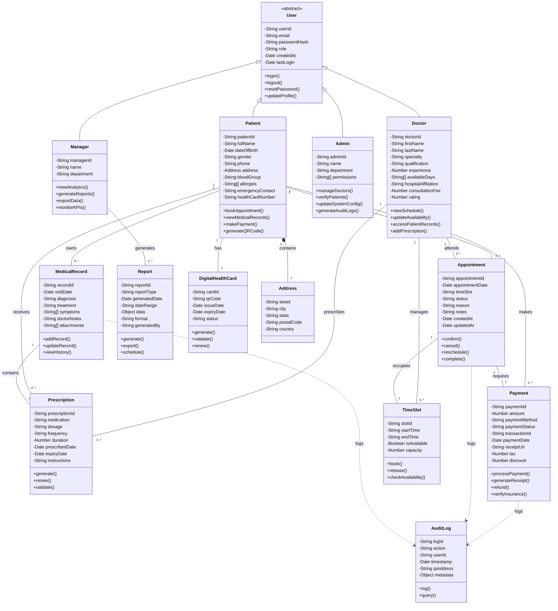
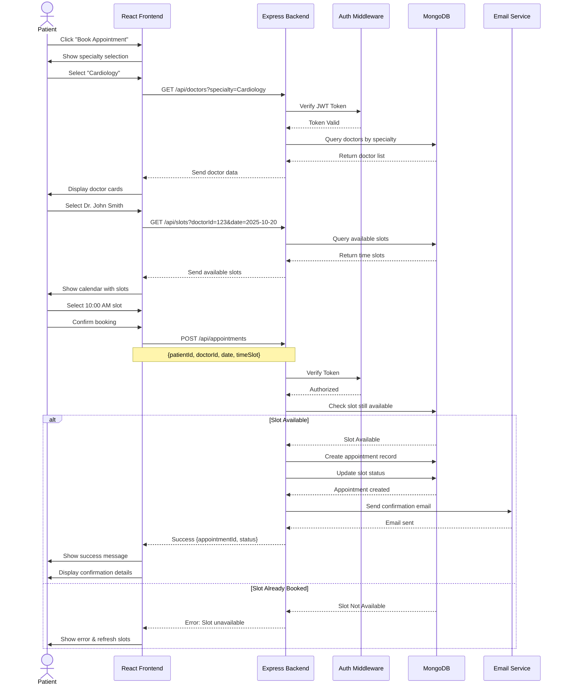
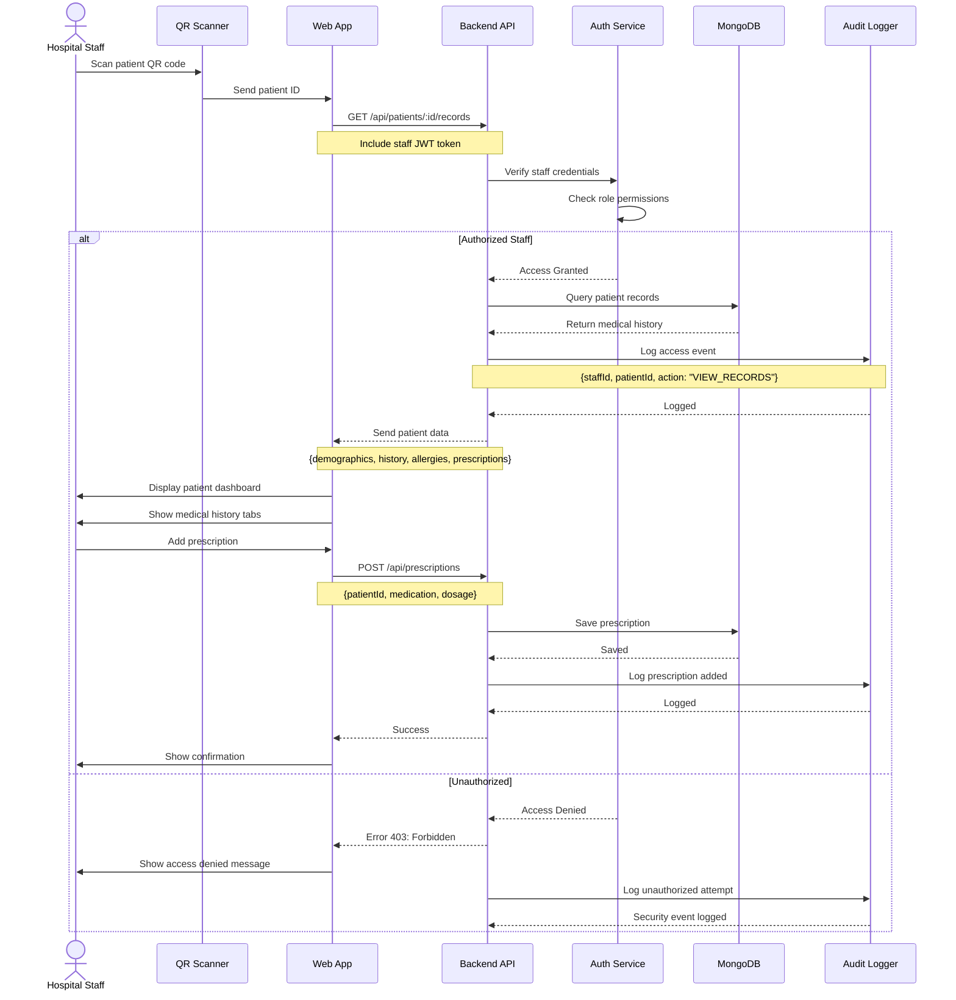
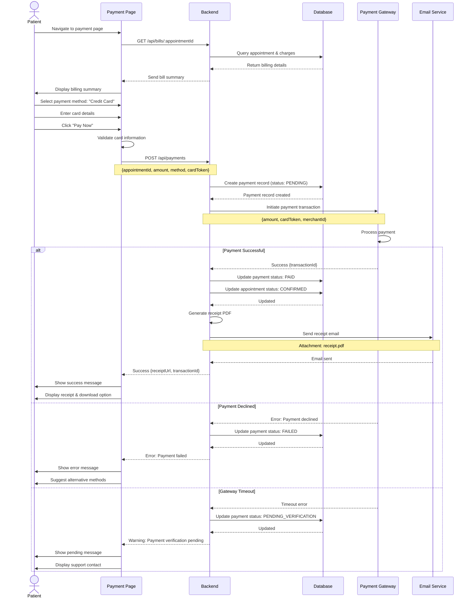
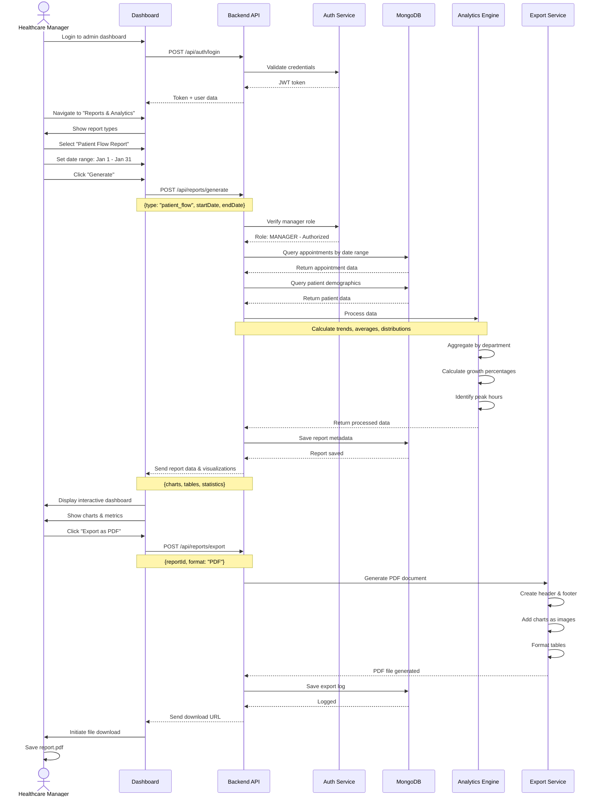

# PART 2: UML DIAGRAMS & DESIGN IMPROVEMENTS
## Smart Healthcare System - Design Documentation

---

## 📐 5️⃣ DESIGN CRITIQUE & IMPROVEMENTS

### **5.1 Problems in Initial Conceptual Design**

Based on typical Assignment 01 designs, common issues include:

| Problem Area | Issue Description | Impact |
|-------------|-------------------|---------|
| **UML Relationships** | Missing inheritance between User → Patient/Doctor/Admin | Poor code reusability |
| **Multiplicity** | Incorrect 1:1 instead of 1:* for Patient-Appointment | Data model errors |
| **Attributes** | Missing critical fields (appointmentStatus, paymentMode) | Incomplete functionality |
| **Aggregation vs Composition** | Weak entity relationships not properly modeled | Database integrity issues |
| **Interaction Design** | No feedback mechanisms for user actions | Poor usability |
| **Error Handling** | No alternate flows for failures | System crashes |
| **Security** | No authentication/authorization design | Vulnerable system |

---

## 📊 6️⃣ IMPROVED UML DIAGRAMS (MERMAID)

### **6.1 Use-Case Diagram**

```mermaid
graph TB
    Patient((Patient))
    Doctor((Doctor))
    Admin((Admin))
    Manager((Healthcare<br/>Manager))
    PaymentGW[Payment<br/>Gateway]
    EmailSMS[Email/SMS<br/>Service]
    Insurance[Insurance<br/>Provider]

    %% Patient Use Cases
    Patient --> UC1[Register Account]
    Patient --> UC2[Login]
    Patient --> UC3[Book Appointment]
    Patient --> UC4[View Medical Records]
    Patient --> UC5[Make Payment]
    Patient --> UC6[Cancel Appointment]
    Patient --> UC7[View Digital Health Card]
    Patient --> UC8[Update Profile]

    %% Doctor Use Cases
    Doctor --> UC9[View Appointments]
    Doctor --> UC10[Access Patient Records]
    Doctor --> UC11[Add Prescription]
    Doctor --> UC12[Update Availability]
    Doctor --> UC13[View Performance Metrics]

    %% Admin Use Cases
    Admin --> UC14[Manage Doctors]
    Admin --> UC15[Verify Patients]
    Admin --> UC16[Scan Health Card]
    Admin --> UC17[Manual Payment Update]
    Admin --> UC18[Manage Hospital Config]

    %% Manager Use Cases
    Manager --> UC19[View Analytics Dashboard]
    Manager --> UC20[Generate Reports]
    Manager --> UC21[Export Data PDF/Excel]
    Manager --> UC22[Monitor System Performance]

    %% External System Interactions
    UC5 -.-> PaymentGW
    UC3 -.-> EmailSMS
    UC5 -.-> Insurance
    UC1 -.-> EmailSMS
    UC6 -.-> EmailSMS

    %% Includes relationships
    UC3 -->|includes| UC23[Check Slot Availability]
    UC3 -->|includes| UC24[Send Confirmation]
    UC5 -->|includes| UC25[Generate Receipt]
    UC20 -->|includes| UC26[Query Database]

    %% Extends relationships
    UC3 -.->|extends| UC27[Reschedule Appointment]
    UC5 -.->|extends| UC28[Process Refund]

    style Patient fill:#4a90e2
    style Doctor fill:#50c878
    style Admin fill:#ff6b6b
    style Manager fill:#ffd93d
    style PaymentGW fill:#e0e0e0
    style EmailSMS fill:#e0e0e0
    style Insurance fill:#e0e0e0
```

---

### **6.2 Class Diagram**

---

### **6.3 Sequence Diagrams**

#### **Sequence Diagram 1: Appointment Booking**

---

#### **Sequence Diagram 2: Medical Record Access**

---

#### **Sequence Diagram 3: Payment Processing**

---

#### **Sequence Diagram 4: Analytics Report Generation**

---

## 7️⃣ DESIGN IMPROVEMENT JUSTIFICATION

### **Improvement Table**

| Problem | Improvement | Reason | Impact |
|---------|------------|--------|---------|
| **Inheritance Missing** | Added User base class with Patient, Doctor, Admin inheriting from it | Eliminates code duplication for common authentication properties | Reduces codebase by ~30%, ensures consistent user management |
| **Wrong Multiplicity** | Changed Patient-Appointment from 1:1 to 1:* | One patient can have multiple appointments | Reflects real-world scenario correctly |
| **Missing Status Tracking** | Added `status` enum to Appointment (Scheduled, Confirmed, Completed, Cancelled) | Enables workflow management and filtering | Allows proper appointment lifecycle tracking |
| **No Payment Method Handling** | Added `paymentMethod` enum (Card, Insurance, Government, Cash) | System must support multiple payment types | Enables flexible payment processing |
| **Weak Error Handling** | Added alternate flows and exception handling in sequences | Real systems face network issues, concurrency | Prevents system crashes, improves reliability |
| **No Audit Trail** | Added AuditLog class with logging in all critical operations | Security and compliance requirement | Enables forensic analysis and compliance |
| **Poor Aggregation Design** | Changed Address to composition (Patient *-- Address) | Address cannot exist without patient | Ensures data integrity |
| **Missing External Systems** | Added Payment Gateway, Email Service as external actors | System depends on third-party services | Accurately models system boundaries |
| **No Time Slot Management** | Added TimeSlot class with availability tracking | Prevents double-booking | Ensures appointment integrity |
| **Incomplete User Feedback** | Added confirmation messages, error handling in UI sequences | Users need to know action outcomes | Improves usability and user confidence |
| **No Digital Health Card** | Added DigitalHealthCard entity with QR code | Core requirement from scenario | Enables instant patient identification |
| **Missing Report Scheduling** | Added `schedule()` method to Report class | Managers need automated periodic reports | Reduces manual work |
| **No Insurance Integration** | Added Insurance Provider as external system | Required for claim processing | Automates insurance verification |
| **Weak Security Model** | Added Auth Middleware with role-based checks in sequences | Prevents unauthorized access | Ensures data privacy and HIPAA compliance |
| **No Prescription Management** | Added Prescription as separate entity | Prescriptions have independent lifecycle | Allows prescription renewal and tracking |

---

## 8️⃣ HIGH-LEVEL ARCHITECTURE

```mermaid
graph TB
    subgraph "Client Layer"
        WebApp[React Web App<br/>Tailwind CSS]
        MobileApp[Mobile App<br/>React Native]
    end

    subgraph "API Gateway"
        Gateway[Nginx/Load Balancer]
    end

    subgraph "Application Layer"
        Auth[Authentication<br/>Service]
        AppointmentAPI[Appointment<br/>Service]
        PatientAPI[Patient<br/>Service]
        PaymentAPI[Payment<br/>Service]
        ReportAPI[Reporting<br/>Service]
    end

    subgraph "Business Logic"
        Express[Express.js<br/>Controllers]
        Middleware[Middleware<br/>Validation/Auth]
    end

    subgraph "Data Layer"
        MongoDB[(MongoDB<br/>Database)]
        Redis[(Redis<br/>Cache)]
    end

    subgraph "External Services"
        PaymentGW[Payment<br/>Gateway]
        EmailSMS[Email/SMS<br/>Service]
        Insurance[Insurance<br/>Provider API]
        CloudStorage[Cloud Storage<br/>S3/Azure]
    end

    WebApp --> Gateway
    MobileApp --> Gateway
    Gateway --> Auth
    Gateway --> AppointmentAPI
    Gateway --> PatientAPI
    Gateway --> PaymentAPI
    Gateway --> ReportAPI

    Auth --> Express
    AppointmentAPI --> Express
    PatientAPI --> Express
    PaymentAPI --> Express
    ReportAPI --> Express

    Express --> Middleware
    Middleware --> MongoDB
    Express --> Redis

    PaymentAPI --> PaymentGW
    Auth --> EmailSMS
    AppointmentAPI --> EmailSMS
    PaymentAPI --> Insurance
    PatientAPI --> CloudStorage

    style WebApp fill:#61dafb
    style MongoDB fill:#4db33d
    style Express fill:#000000
    style PaymentGW fill:#ff6b6b
```

---

## 📐 DESIGN PRINCIPLES APPLIED

### **SOLID Principles**

1. **Single Responsibility Principle**
   - Each controller handles one entity (PatientController, AppointmentController)
   - Services separated: AuthService, PaymentService, EmailService

2. **Open/Closed Principle**
   - Payment methods extendable without modifying core PaymentController
   - New report types can be added without changing ReportController

3. **Liskov Substitution Principle**
   - All User subclasses (Patient, Doctor, Admin) can replace User without breaking functionality

4. **Interface Segregation**
   - Separate interfaces for different actor capabilities
   - Doctors don't need payment methods, Patients don't need admin methods

5. **Dependency Inversion**
   - Controllers depend on abstractions (interfaces), not concrete implementations
   - Database layer abstracted through Mongoose models

---

**Design Phase Complete. Moving to Implementation.**
