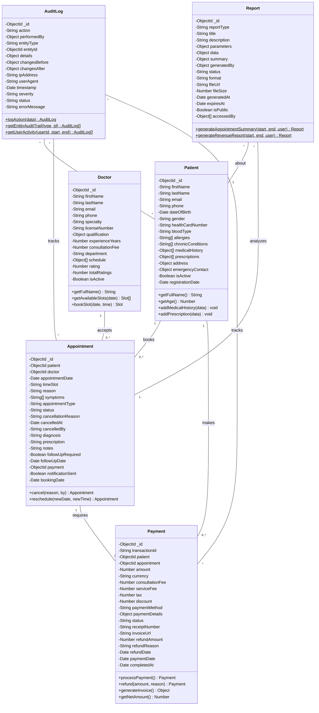
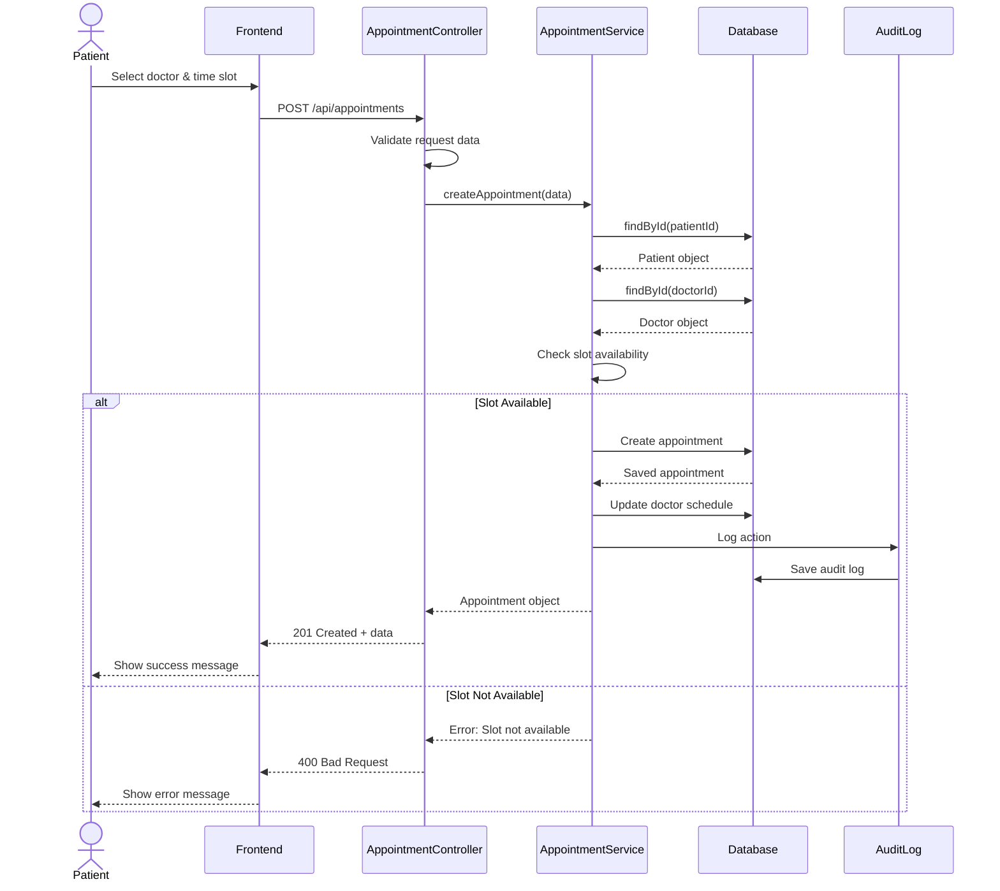
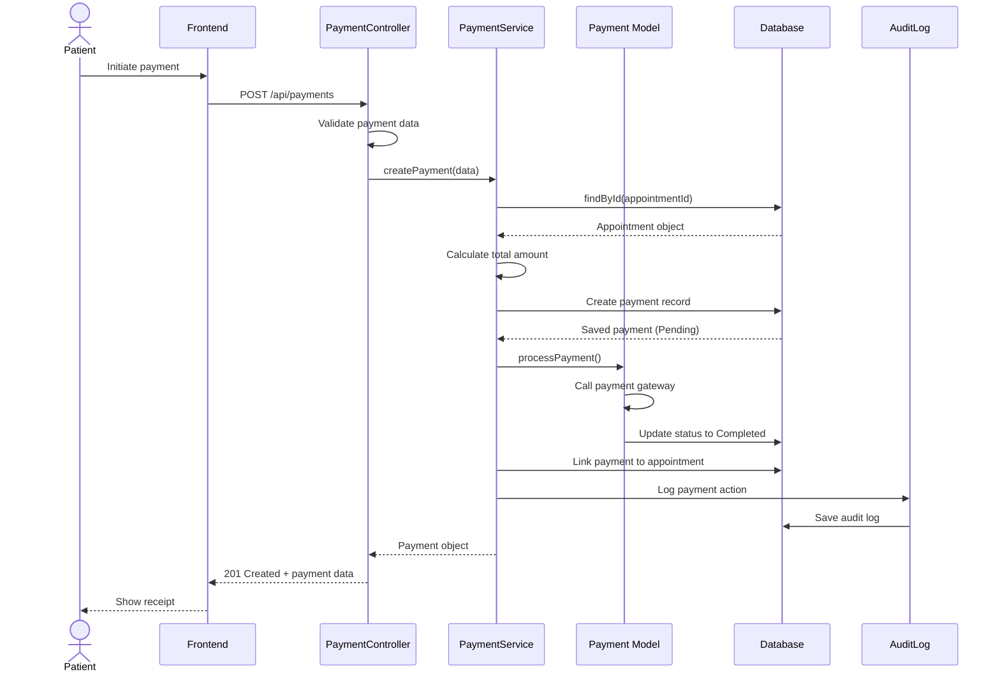
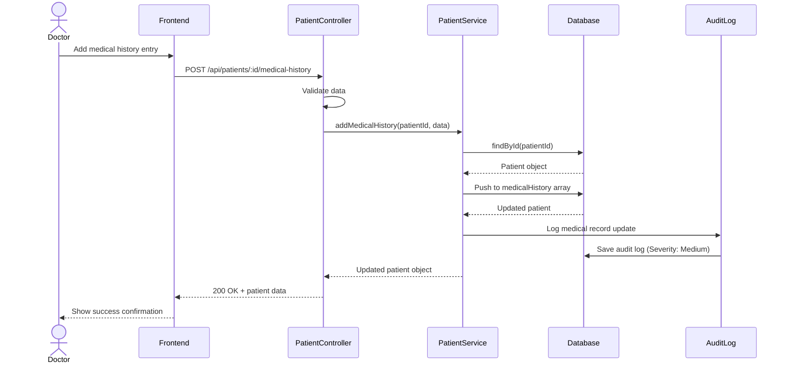
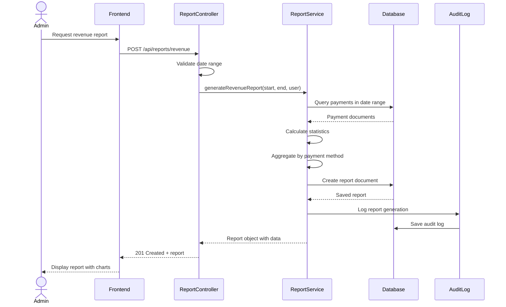
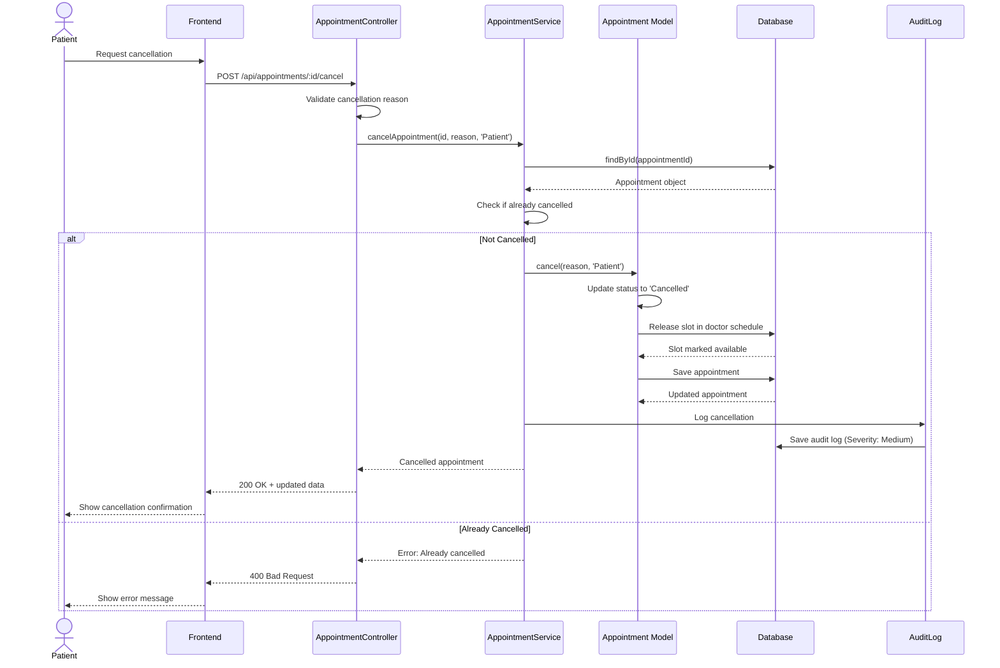

# UML Diagrams - Smart Healthcare System
## SE3070 Assignment 02

This document contains all UML diagrams in text format (Mermaid syntax).

---

## 1. Use Case Diagram

```mermaid
graph TB
    Patient((Patient))
    Doctor((Doctor))
    Admin((Administrator))
    System[System]
    
    subgraph "Smart Healthcare System"
        direction TB
        
        subgraph "Appointment Management"
            UC1[Search Doctors]
            UC2[View Available Slots]
            UC3[Book Appointment]
            UC4[Cancel Appointment]
            UC5[Reschedule Appointment]
            UC6[View Appointment History]
        end
        
        subgraph "Patient Management"
            UC7[Register Patient]
            UC8[Update Profile]
            UC9[View Medical Records]
            UC10[Add Medical History]
            UC11[Add Prescription]
        end
        
        subgraph "Payment Management"
            UC12[Make Payment]
            UC13[View Payment History]
            UC14[Process Refund]
            UC15[Generate Invoice]
        end
        
        subgraph "Reporting & Analytics"
            UC16[View Dashboard]
            UC17[Generate Appointment Report]
            UC18[Generate Revenue Report]
            UC19[View Patient Statistics]
        end
        
        subgraph "Doctor Operations"
            UC20[Manage Schedule]
            UC21[View Patient Information]
            UC22[Update Medical Records]
        end
    end
    
    Patient --> UC1
    Patient --> UC2
    Patient --> UC3
    Patient --> UC4
    Patient --> UC5
    Patient --> UC6
    Patient --> UC7
    Patient --> UC8
    Patient --> UC9
    Patient --> UC12
    Patient --> UC13
    
    Doctor --> UC20
    Doctor --> UC21
    Doctor --> UC22
    Doctor --> UC10
    Doctor --> UC11
    
    Admin --> UC16
    Admin --> UC17
    Admin --> UC18
    Admin --> UC19
    Admin --> UC14
    
    UC3 -.-> System
    UC4 -.-> System
    UC12 -.-> System
    UC17 -.-> System
```



---

## 2. Class Diagram



---

## 3. Sequence Diagrams

### 3.1 Appointment Booking Sequence



### 3.2 Payment Processing Sequence



### 3.3 Medical Record Update Sequence



### 3.4 Report Generation Sequence



### 3.5 Appointment Cancellation Sequence



---

## 4. Activity Diagram - Appointment Booking Process

```
START
  ↓
[Patient Logs In]
  ↓
[Select Specialty] ─→ [View Doctors List]
  ↓
[Select Doctor] ─→ [View Available Dates]
  ↓
[Select Date] ─→ [View Time Slots]
  ↓
[Select Time Slot]
  ↓
[Enter Reason & Symptoms]
  ↓
<Validate Input> ──[Invalid]──→ [Show Error] ─→ (Back to Form)
  ↓ [Valid]
<Check Slot Availability>
  ↓ [Available]           ↓ [Not Available]
[Create Appointment]    [Show Error Message]
  ↓                       ↓
[Update Doctor Schedule] (Return to Slot Selection)
  ↓
[Log to Audit Trail]
  ↓
[Send Confirmation Email]
  ↓
[Display Success Message]
  ↓
END
```

---

## 5. State Diagram - Appointment Lifecycle

```
[Scheduled] ──[Doctor Confirms]──→ [Confirmed]
    ↓                                   ↓
    ↓ [Patient/Doctor Cancels]   [Appointment Time]
    ↓                                   ↓
    ↓                              [In-Progress]
    ↓                                   ↓
    ↓                            [Doctor Completes]
    ↓                                   ↓
    ↓                              [Completed]
    ↓
    → [Cancelled]
    
[Completed] ──[Needs Follow-up]──→ [New Appointment Created]

[No-Show] ← [Patient Doesn't Arrive] ← [Confirmed]
```

---

## 6. Entity Relationship Diagram (ERD)

```
PATIENT ||--o{ APPOINTMENT : books
DOCTOR ||--o{ APPOINTMENT : accepts
APPOINTMENT ||--o| PAYMENT : requires
PATIENT ||--o{ PAYMENT : makes
DOCTOR ||--o{ MEDICAL_HISTORY : creates
PATIENT ||--o{ MEDICAL_HISTORY : has
APPOINTMENT ||--o{ AUDIT_LOG : generates
PAYMENT ||--o{ AUDIT_LOG : generates
PATIENT ||--o{ AUDIT_LOG : generates

Cardinality:
|| = one
o{ = zero or many
o| = zero or one
```

---

**Note:** These diagrams can be rendered using Mermaid-compatible tools like:
- GitHub (native support)
- VS Code (with Mermaid extension)
- draw.io (with Mermaid plugin)
- Online: mermaid.live
